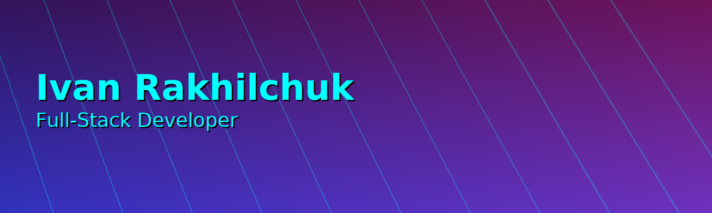

  

<h1 align="center">Hi 👋, I'm Ivan Rakhilchuk</h1>

  Aspiring Full-Stack Web Developer • Currently in training • Open to freelance projects

---

## 🚀 About Me
- 👨‍💻 Becoming a **Full-Stack Developer** step by step  
- 🎯 My goals: remote work + freelance clients  
- 📚 I grow through practice and real projects  
- 📩 How to reach me → see Contact section below

---

## 🧠 Current Learning

  
  
  
  
  

### 🧠 Tech Stack

---

### 📁 Portfolio Projects

| Project | Live Demo | Code |
|----------|------------|------|
| 🌐 **Portfolio Website** | [🔗 View Site](https://ivanrakhilchuk.github.io/portfolio-website/) | [💻 Repository](https://github.com/IvanRakhilchuk/portfolio-website) |
| 🔐 **JS Mini Project – Password Generator** | [🔗 View App](https://ivanrakhilchuk.github.io/js-mini-project/) | [💻 Repository](https://github.com/IvanRakhilchuk/js-mini-project) |
| 🚀 **Full-Stack App** | Coming soon | MERN Stack |

---

## 📬 Contact
- 📧 Email: **vvasilovich00@gmail.com**
- 💼 GitHub: [@IvanRakhilchuk](https://github.com/IvanRakhilchuk)
- 🔗 LinkedIn: Coming Soon

---

## 📊 GitHub Stats

  
  

---

⭐️ _This profile page will grow together with my skills_  

